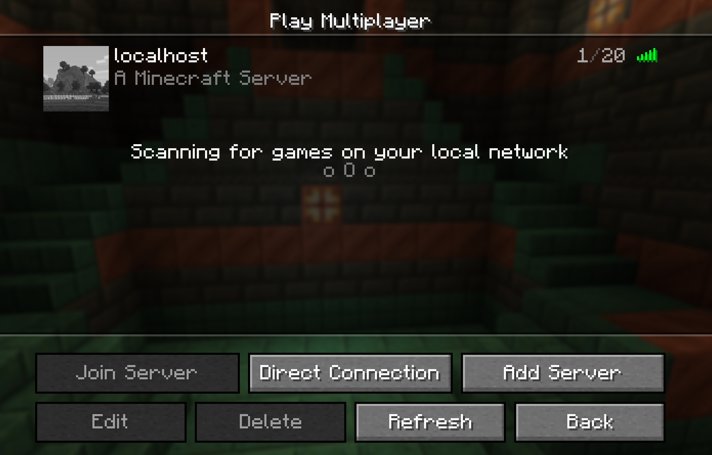

The most popular Java Minecraft docker image is: <https://github.com/itzg/docker-minecraft-server>. It's very easy to use with some basic settings, requires setting `EULA: true` as an environment variable and setting 25565 as `ContainerPort`.

## Base Minecraft Deployment
The BlackCoral server runs a minecraft server as a base deployment created with these settings passed to interal function for the `/create_deployment` command:

```go
{
	DeploymentName: "minecraft",
	ExtraLabels:    map[string]string{"base": "true"},
	Image:          "docker.io/itzg/minecraft-server",
	CPU:            resource.MustParse("1000m"),
	Memory:         resource.MustParse("2000Mi"),
	Storage:        resource.MustParse("10Gi"),
	Ports:          []Port{{ContainerPort: 25565, ServicePort: 25565, Protocol: corev1.ProtocolTCP}},
	Env:            map[string]string{"EULA": "TRUE"},
	LivenessProbe: corev1.Probe{
		InitialDelaySeconds: 100,
		PeriodSeconds:       DefaultLivenessProbe.PeriodSeconds,
		TimeoutSeconds:      DefaultLivenessProbe.TimeoutSeconds,
		SuccessThreshold:    DefaultLivenessProbe.SuccessThreshold,
		FailureThreshold:    DefaultLivenessProbe.FailureThreshold,
		ProbeHandler: corev1.ProbeHandler{
			TCPSocket: &corev1.TCPSocketAction{
				Port: intstr.FromInt(25565),
			},
		},
	},
},
```

With a connection to the BlackCoral Kubernetes cluster(use `/connect`) you can use connect to this Minecraft base deployment by forwarding it to your localhost 25565 port: `kubectl port-forward -n exposed svc/minecraft 25565:25565`.



## Running Your Own Public Minecraft Server in BlackCoral
Create a deployment with Discord command(ensure that deployment name is unique): `/create-deployment name: marks-minecraft-server image_name: docker.io/itzg/minecraft-server ports: 25565:25565 env: EULA=true cpu: 500 memory: 1500 storage: 8000 exposed: true`

See your deployments public port service on the Kubernetes environment with kubectl, or on Discord with `/list-deployments`:

```
$ kubectl get svc -n exposed | grep marks-minecraft
marks-minecraft-server   ClusterIP   10.43.12.143    <none>        25565/TCP           19s
```

Now anyone who is connected to the BlackCoral Kubernetes cluster can port-forward your minecraft server and connect because it is `exposed`:

```
$ kubectl port-forward -n exposed svc/marks-minecraft-server 25565:25565
Forwarding from 127.0.0.1:25565 -> 25565
Forwarding from [::1]:25565 -> 25565
```

You can monitor resource usage of the server with `kubectl top pods -n exposed`:

```
$ kubectl top pods -n exposed | grep marks-minecraft-server
marks-minecraft-server-59b5fc96b6-dmgxp   487m         560Mi
```
